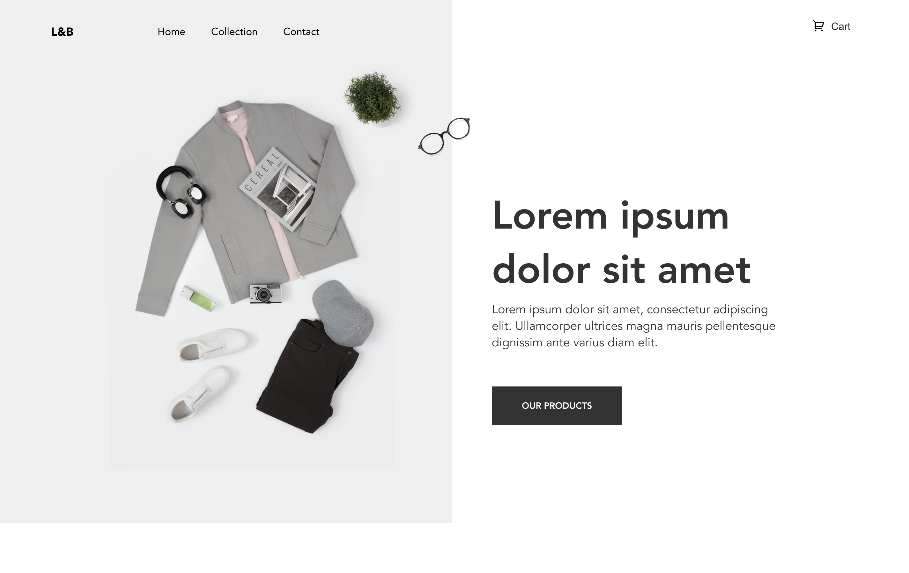

<h1 dir="rtl"> مشروع بناء متجر الكتروني</h1>

<h2 dir="rtl">نبذة عن المشروع:</h2>

تعرفت على React في هذا الدرس، الآن حان الوقت لوضعه موضع الاختبار عن طريق إنشاء موقع ويب للتجارة الإلكترونية. ينقسم هذا المشروع إلى قسمين.

يغطي القسم الأول, التصميم حيث ستقوم ببناء المكونات وملء ملف النمط (CSS) (أو يمكنك اختيار أي من الطرق لإضافة نمط إلى تطبيق react الخاص بك).

يغطي الجزء الثاني إضافة الحالة state والطرق routes ومعالجات الأحداث events.

<h2 dir="rtl">الهدف من هذا المشروع؟ </h2>

الغرض من هذا المشروع تطبيق المفاهيم التي تعلمتها في هذا الدرس وتطوير تطبيق بالفعل من البداية.

<h2 dir="rtl">ما الذي سوف تتعلمه من هذا المشروع؟</h2>

يجمع هذا المشروع العديد من الأفكار والمهارات التي تعلمناها خلال الدروس والتي تشمل على:

<ul>
<li dir="rtl">تحويل التصميم إلى تطبيق react</li>
<li dir="rtl">عمل مكونات (components)</li>
<li dir="rtl">التصميم في react</li>
<li dir="rtl">تقديم القوائم أي list rendering</li>
<li dir="rtl">باستخدام props لتخصيص المكونات</li>
<li dir="rtl">استخدام JSX</li>
<li dir="rtl">باستخدام state لتحديث البيانات</li>
<li dir="rtl">إضافة عناصر النموذج أي form elements</li>
<li dir="rtl">إضافة معالجات الأحداث أي event handlers</li>
<li dir="rtl">routing في react</li>
</ul>

<h2 dir="rtl">متطلبات المشروع: </h2>

يجب أن يحتوي المشروع على المزايا التالية:

<h3 dir="rtl">الشروط:</h3>

<ul>
<li dir="rtl">يشبه تصميم التطبيق ملف figma</li>
<li dir="rtl">استخدام css في react لتنسيق</li>
<li dir="rtl">استخدام ملف البيانات لتخصيص المكونات وتقديم قائمة</li>
<li dir="rtl"> وجود قيمتين لـ state واحد للبيانات والآخر لـ orders</li>
<li dir="rtl">يجب أن تكون حالة state قابلة للتحديث باستخدام setState</li>
<li dir="rtl">باستخدام routes في التطبيق</li>
<li dir="rtl">إضافة معالجات الأحداث ، مثل النقر فوق عنصر لفتح صفحة التفاصيل ، والنقر زر الإضافة إلى السلة لإضافته للطلب ، وتغيير كمية الطلب ، وازالة عنصر من الطلب.</li>
</ul>

<h2 dir="rtl"> ملحقات المشروع:</h2>

<a href="https://www.figma.com/proto/OYKnwc9t4ym4Bx6J6pTtc7/e-commerce-L%26B?node-id=3%3A2&viewport=-4583%2C-79%2C1.3125267028808594&scaling=min-zoom">التصميم</a>

<h2 dir="rtl">بناء المشروع</h2>

لإكمال هذا المشروع يجب عليك تحميل ملف المشروع من الرابط اعلاه، و إستخدام code editor لإتمام المتطلبات الخاصة بالمشروع و المذكورة أعلاه.

سيتم تقييم المشروع بناء على المعايير الآتي ذكرها تحت بند تقييم المشروع.

<h3 dir="rtl">الوظيفة</h3>

<ul>
<li dir="rtl">القدرة على تغيير الطرق (routes)</li>
<li dir="rtl">تصميم مطابق لملف التصميم</li>
<li dir="rtl">وجود CSS في التطبيق</li>
<li dir="rtl">تقديم قائمة list rendering</li>
<li dir="rtl">وجود state تحتوي على كائن للبيانات وآخر لـ orders</li>
<li dir="rtl">يتم التعامل مع الأحداث مثل فتح صفحة التفاصيل، وإضافة العنصر إلى السلة ، وإزالة العنصر من السلة ، وتغيير كمية العنصر في السلة.</li>
</ul>

<h3 dir="rtl">كود المشروع</h3>

<ul>
<li dir="rtl">يجب عدم إضافة أسطر فارغة زائدة غير ضرروية.</li>
<li dir="rtl">يجب تنسيق الكود بشكل مناسب بحيث تكون هناك ازاحة بين الكود داخل الدالة وبين تعريف الدالة.</li>
<li dir="rtl">اضافة التعليقات التي تشرح سبب كتابة الكود بطريقة معينة.</li>
</ul>

